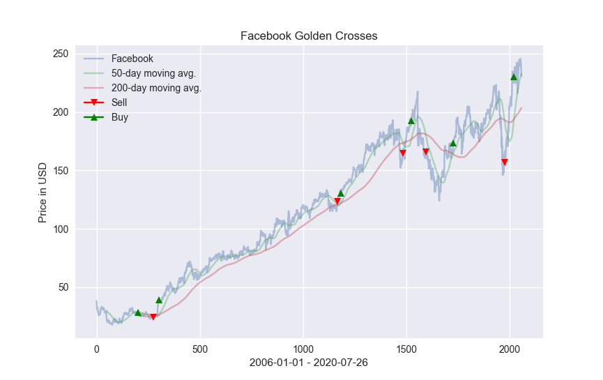

# Algorithmic Trading

## General info
Example of an algorithmic strategy based on 50- and 200-day moving averages using Python. \
\
Code inspired by YouTube channel “Computer Science” \
(https://www.youtube.com/watch?v=SEQbb8w7VTw). \
\
Data source: https://finance.yahoo.com

## Table of contents
* [Screenshot](#screenshots)
* [Setup](#setup)
* [Usage](#usage)
* [Owner](#owner)
* [License](#license)

## Screenshot


## Setup
### Clone the source:

```shell
$ git clone https://github.com/milenakowalska/Algoritmic_trading
$ cd Algoritmic_trading
```
### Install packages

```shell
$ pip3 install -r requirements.txt
```
### Run the program

```shell
$ python3 facebook_trading.py
```

## Usage
Run program to see the plot representing Facebook closing price from 2006-01-01 to 2020-07-26 and its 50-day and 200-day moving averages. \
Red markers indicate death crosses, while green markers indicate golden crosses.

## Owner
Created by milenakowalska.

## License
[](http://badges.mit-license.org)

- **[MIT license](http://opensource.org/licenses/mit-license.php)**
